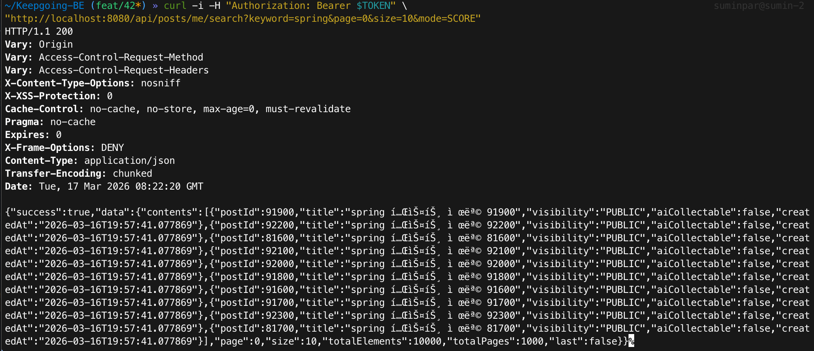
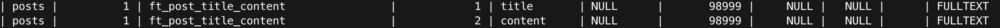
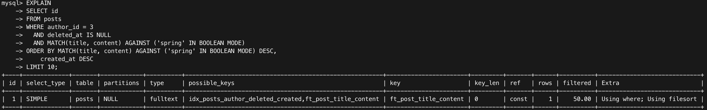
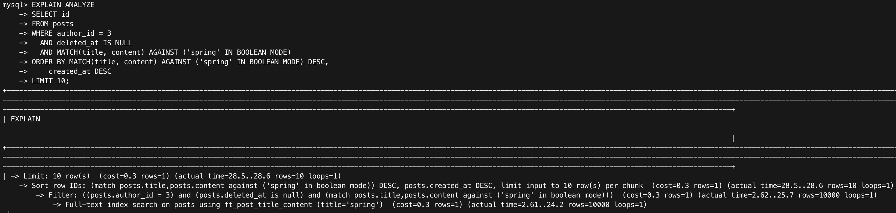
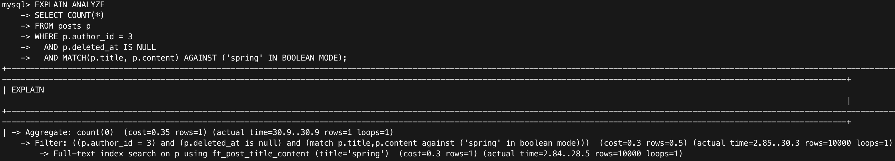
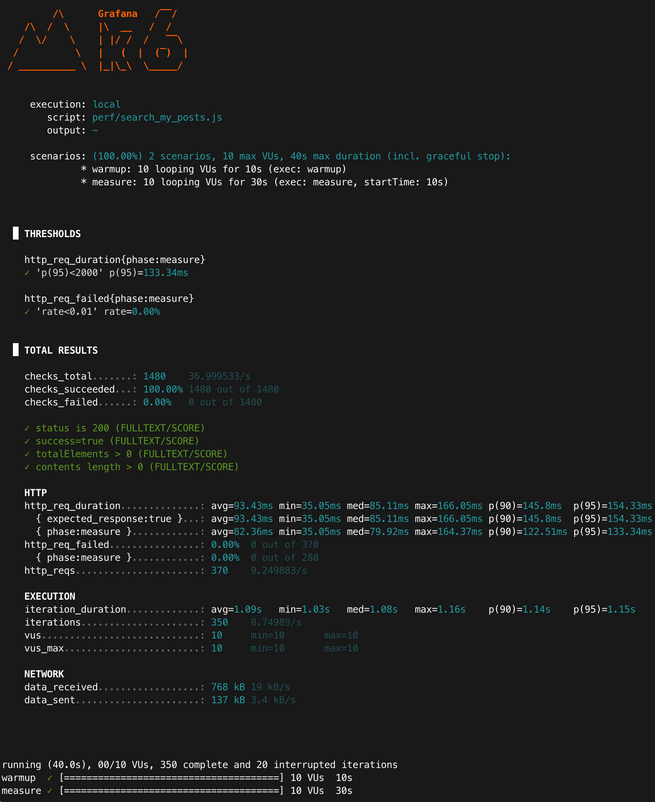

> **[Archive]** MySQL 8.0 FULLTEXT 기반 벤치마크. PostgreSQL 전환(#55) 이후 현재 API와 일치하지 않음.

# Improved: 내 글 검색 성능 (MySQL, FULLTEXT by SCORE)

## 목적
- LIKE 기반 검색의 병목(contains 검색)을 개선하기 위해 MySQL FULLTEXT(MATCH...AGAINST)를 적용한다.
- 개선 전/후 성능(latency, p95)을 동일 조건에서 비교한다.
- “왜 빨라졌는지”를 EXPLAIN/EXPLAIN ANALYZE로 근거화한다.

---

## 환경
- Runtime: Colima + Docker Compose
- DB: MySQL 8.0 (docker)
- App: Spring Boot (profile=local)
- Target endpoint: `GET /api/posts/me/search` (mode=SCORE)
- Auth: Bearer JWT accessToken 사용
- k6: `vus=10`, `duration=30s`
  (참고: 스크립트에 `sleep(1)` 포함 → iteration_duration ≈ 1s)

### API 스모크 체크(빈 결과 방지)
- 목적: 측정 전에 “인증/author_id 매칭/데이터 주입”이 정상인지 확인한다.
- Scenario URL: `GET /api/posts/me/search?keyword=spring&page=0&size=10&mode=SCORE`
- 기대: HTTP 200 + totalElements > 0

<p align="center">
    0)">
</p>

---

### 동일 조건 체크리스트(전/후 공정성)
- 데이터: posts=100,000 / keyword(spring) 포함=10% / author_id=3 / deleted_at IS NULL
- API: `GET /api/posts/me/search?keyword=spring&page=0&size=10&mode=SCORE`
- 정렬: score(relevance) DESC + 최신순(`created_at DESC`) + LIMIT 10
- 부하(k6): warmup 10s → measure 30s, vus=10, sleep=1s
- 실행: 각 시나리오 3회(run1~run3) 측정 후 mean(평균) + 범위(min~max) 기록

### warm-up을 두는 이유
- warmup 구간은 DB buffer pool/OS page cache/JIT 워밍업 영향을 줄여, measure 구간의 편차를 낮추기 위함이다.
- 결과 비교는 measure(30s) 구간만 사용한다.

### 실험 설계(재현성)
- measure 구간 기준으로 3회(run1~run3) 반복 측정하고 mean(평균) + 범위(min~max)를 함께 기록한다.
- 로컬/도커 환경 특성상 편차가 존재하므로, 전/후 비교는 동일 조건에서의 상대 비교로 해석한다.

---

## 변경 사항(요약)
### 1) 인덱스: FULLTEXT 추가
- posts(title, content)에 FULLTEXT 인덱스 추가
- 인덱스명: `ft_post_title_content`

증거:
- `SHOW INDEX FROM posts;` 결과에서 `ft_post_title_content`가 title/content에 걸려 있음

<p align="center">
  
</p>

### 2) 쿼리: LIKE → MATCH AGAINST (BOOLEAN MODE)
기존(LIKE, contains):
- `title LIKE '%spring%' OR content LIKE '%spring%'`
개선(FULLTEXT):
- `MATCH(title, content) AGAINST ('spring' IN BOOLEAN MODE)`
정렬 전략:
- relevance(score) 우선 + 최신순 보조
- `ORDER BY MATCH(...) AGAINST(...) DESC, created_at DESC`

---

## 데이터 세팅(동일 조건)
- 기준 사용자(author_id): **3**
- posts: **100,000 rows**
- keyword 분포: **spring 10% 포함** (seed 규칙: n % 10 == 0 일 때 spring 포함)

### 데이터 증거
```sql
SELECT
  COUNT(*) AS total,
  SUM((title LIKE '%spring%') OR (content LIKE '%spring%')) AS matched
FROM posts
WHERE author_id = 3 AND deleted_at IS NULL;
```
- 기대값: total=100000 / spring_rows=10000

(이미 baseline 문서에 있는 데이터 증거와 동일 조건 유지)
<p align="center">
    
</p>

---

## 실행 계획(개선 근거)
### EXPLAIN (FULLTEXT 기반)
쿼리:
```sql
EXPLAIN
SELECT id
FROM posts
WHERE author_id = 3
  AND deleted_at IS NULL
  AND MATCH(title, content) AGAINST ('spring' IN BOOLEAN MODE)
ORDER BY MATCH(title, content) AGAINST ('spring' IN BOOLEAN MODE) DESC, 
    created_at DESC
LIMIT 10;
```

- type: fulltext
- key: ft_post_title_content
- Extra: Using where; Using filesort (score+created_at 정렬 단계에서 발생 가능)

#### 해석:
- LIKE 방식은(author_id 조건으로 인덱스를 타더라도) '%spring%' 부분을 인덱스로 해결할 수 없어 대량 스캔이 발생했다.
- FULLTEXT는 역인덱스로 후보를 빠르게 좁힌 뒤 relevance(score)를 계산해 정렬한다.
- Extra에 Using filesort가 보일 수 있는데,
  - 이는 score + created_at 정렬을 위해 후보 집합을 정렬하는 단계가 필요하기 때문이며,
  - 핵심은 후보 집합이 FULLTEXT로 “줄어든 상태”에서 sort가 수행된다는 점이다.
> LIMIT 10이 있어도 score+created_at 정렬(filesort) 비용이 남을 수 있다. 
> 다만 LIKE 대비 핵심 차이는 "정렬 대상 후보군이 FULLTEXT로 줄어든 상태"에서 정렬이 수행된다는 점이다.

<p align="center">
  
</p>

### EXPLAIN ANALYZE (측정)
- 목적: 개선 전(LIKE)과 동일 조건에서 실제 실행 시간/행 처리량/정렬 비용을 수치로 비교한다.
- 측정 방법:
```sql
EXPLAIN ANALYZE
SELECT id
FROM posts
WHERE author_id = 3
  AND deleted_at IS NULL
  AND MATCH(title, content) AGAINST ('spring' IN BOOLEAN MODE)
ORDER BY MATCH(title, content) AGAINST ('spring' IN BOOLEAN MODE) DESC,
    created_at DESC
LIMIT 10;
```

#### EXPLAIN ANALYZE 원문 일부
```text
 -> Limit: 10 row(s) ... (actual time=28.5s..28.6s rows=10 loops=1)
    -> Sort row IDs: ... (actual time=28.5s..28.6s rows=10 loops=1)
        -> Filter: ... (actual time=2.62s..25.7s rows=10000 loops=1)
            -> Full-text index search on posts using ft_post_title_content ... (actual time=2.61s..24.2s rows=10000 loops=1)
```

<p align="center">
    
</p>

### COUNT 쿼리 비용(Page의 countQuery)
Spring Data `Page`는 `totalElements/totalPages` 계산을 위해 동일 조건의 `COUNT(*)`를 추가로 실행한다.
따라서 FULLTEXT/SCORE 요청 1회당 **(1) content query + (2) count query**가 함께 수행되며, 키워드가 흔한(10%) 워크로드에서는 countQuery가 병목이 될 수 있다.

COUNT 쿼리:
```sql
EXPLAIN ANALYZE
SELECT COUNT(*)
FROM posts p
WHERE p.author_id = 3
  AND p.deleted_at IS NULL
  AND MATCH(p.title, p.content) AGAINST ('spring' IN BOOLEAN MODE);
```

캡처 요약:
- Full-text index search rows=10000 (spring 10% 워크로드)
- actual time: **~2.84..28.5s** (FTS scan) / **~30.9s** (COUNT aggregate 전체)

<p align="center">
  
</p>

### DB(초 단위) vs k6(API, ms 단위) 괴리 해석
- EXPLAIN ANALYZE는 **DB에서 쿼리 1회**를 단독 실행한 실측이며, 캐시 상태(cold/hot)·동시성·실행 시점에 따라 초 단위로 크게 흔들릴 수 있다.
- k6는 warmup 이후에 **API 전체 시간**(인증/컨트롤러/서비스/DB/직렬화/네트워크)을 반복 측정한 통계치(avg/p95)다.
- 본 문서에서는 DB 근거는 "병목 가능성(특히 countQuery)"을 설명하는 용도로 사용하고, 서비스 체감 성능은 k6 지표로 판단한다.

---

## k6 결과(warm-up 10s + measure 30s)
- baseline과 동일 조건(warm-up 10s + measure 30s, vus=10, keyword=spring, size=10, sleep=1s)에서 3회 측정(run1~run3)
- 실행 커맨드:
```bash
VARIANT=FULLTEXT MODE=SCORE TOKEN="$TOKEN" KEYWORD="spring" \
  k6 run --summary-export "docs/perf/results/fulltext_score_spring_run1.json" perf/search_my_posts_mysql.js
```

### 측정 결과 (phase=measure) - run3
- http_req_duration{phase:measure} avg: **82.37ms**
- http_req_duration{phase:measure} p(95): **133.35ms**
- http_reqs: **370** (≈ **9.25 req/s**)
- http_req_failed{phase:measure}: **0.00%**
- 근거: summary-export JSON (`fulltext_score_spring_run3.json`)

<p align="center">
  
</p>

### k6 3회 측정 결과(phase=measure) 요약

| run | http_req_duration{phase:measure} avg (ms) | http_req_duration{phase:measure} p95 (ms) | http_reqs (count) | req/s(대략) | http_req_failed{phase:measure} |
|---:|------------------------------------------:|------------------------------------------:|------------------:|-----------:|------------------------------:|
| 1 | 85.57 | 147.30 | 372 | 9.30 | 0.00% |
| 2 | 73.11 | 131.81 | 371 | 9.27 | 0.00% |
| 3 | 82.37 | 133.35 | 370 | 9.25 | 0.00% |
| **mean** | **80.35** | **137.49** | **371** | **9.27** | **0.00%** |

- 편차 범위(run1~3): avg 73.11~85.57ms / p95 131.81~147.30ms (3회 반복, phase=measure).

#### 지표 해석
- `avg`: 평균 응답시간(중심 지표)
- `p95`: 상위 5% 느린 응답 경계(체감 품질)
- `req/s`: 처리량(응답이 느려지면 감소)
- `fail`: 실패율(0% 유지가 비교 전제)


### 추가 관측
- req/s(≈9.27)는 `sleep=1s`가 포함된 시나리오에서 "응답 시간 + 대기"가 합쳐진 결과이며, 응답 시간이 길어지면 동일 VU에서 req/s도 함께 감소한다.
- 결과 비교 시에는 `http_req_duration{phase:measure}`(avg/p95) + `http_reqs`(처리량) + `http_req_failed`(실패율)을 함께 본다.

---

## 결론

### 요약
- FULLTEXT/SCORE는 역인덱스(type=fulltext)를 사용하지만, `score + created_at` 정렬 때문에 `Using filesort`가 발생한다.
- `Page` 응답은 요청 1회당 `content query(LIMIT 10)` + `countQuery(COUNT(*))`가 함께 실행된다. 키워드가 흔한(10%) 워크로드에서는 countQuery가 rows=10000을 끝까지 스캔/집계하며 병목이 될 수 있다(본 문서의 COUNT EXPLAIN ANALYZE 근거).
- k6(phase=measure) 기준으로는 avg≈80ms, p95≈137ms, 실패율 0%로 기능/성능이 안정적으로 동작함을 확인했다.
- 운영 관점에서는 `Page` 대신 `Slice` 사용(=countQuery 제거) 또는 count 근사/캐시 전략까지 함께 고려할 가치가 있다.

### Baseline(LIKE) 대비 (k6 지표)
> 주의: k6는 API 전체 시간(보안/직렬화/네트워크 포함)이며, DB 단독 시간(EXPLAIN ANALYZE)과 스케일이 다를 수 있다.

| 항목 | LIKE(mean, phase=measure) | FULLTEXT/SCORE(mean, phase=measure) |
|---:|---:|---:|
| avg | 368.27ms | 80.35ms |
| p95 | 494.40ms | 137.49ms |
| req/s | 7.33 | 9.27 |
| fail | 0.00% | 0.00% |

### 왜 FULLTEXT/NEWEST를 추가로 측정하나
- SCORE 정렬은 검색 품질(랭킹)을 높이지만, `Using filesort` 및 countQuery 비용이 커질 수 있다.
- NEWEST 정렬은 `created_at DESC`로 정렬 비용을 줄여, "검색 품질 vs 성능" 트레이드오프를 정량적으로 비교할 수 있다.
- 따라서 SCORE/NEWEST를 함께 측정해야 운영에서 선택할 정렬 정책을 근거 기반으로 결정할 수 있다.

### 운영/롤백 고려
- 대량 seed(10만)는 `docs/perf/`에 분리해 성능 테스트 시점에만 주입한다.
- local 프로필에서만 seed 위치를 추가하여 운영 환경에 seed가 적용되지 않도록 한다.
- FULLTEXT 적용 후 문제가 발생하면 기존 LIKE 메서드(`searchMyPostsLike`)로 즉시 롤백 가능하도록 병행 유지한다.

---

## 참고(측정 스코프)
- 로컬(single-machine) 환경에서의 측정 결과이며 배포 환경/네트워크 조건에 따라 절대값은 달라질 수 있다.
- 단, 동일 조건에서 전/후 비교(개선 효과 확인)에는 충분히 유효하다.
