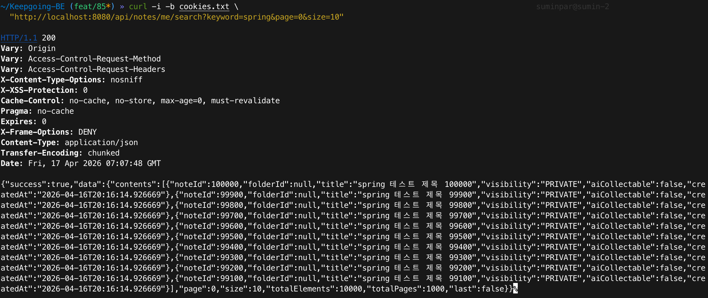
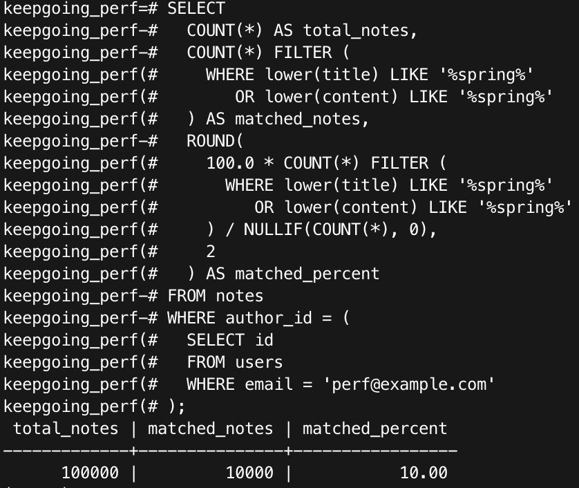
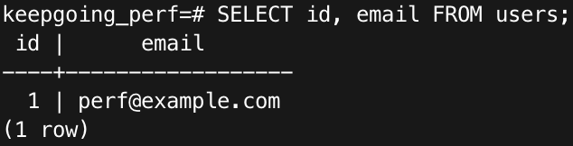
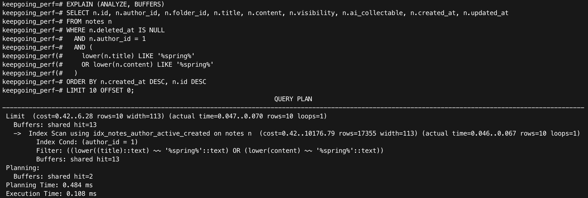
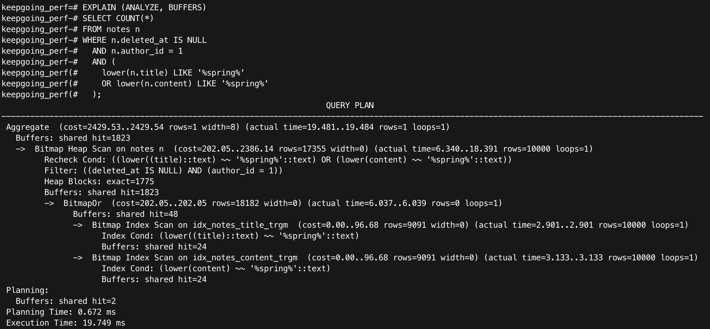
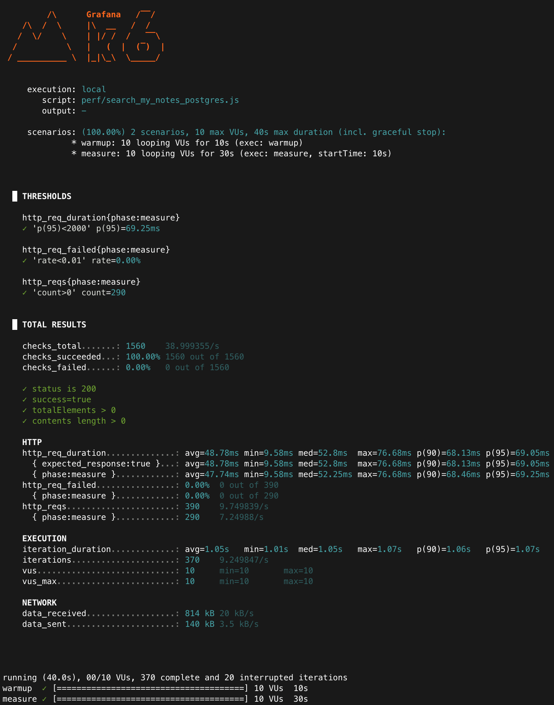

# Baseline: 내 노트 검색 성능 (PostgreSQL, LIKE + pg_trgm + Page)

## 목적

현재 PostgreSQL 환경에서 `/api/notes/me/search`의 baseline 성능을 측정하고,
실제 병목이 content query인지 `Page` 응답 생성을 위한 count query인지 확인한다.

- 현재 구현의 baseline 지표(latency, p95)를 확보한다.
- PostgreSQL의 `pg_trgm` + GIN 인덱스가 실제 검색 쿼리에서 어떻게 사용되는지 확인한다.
- `Page` 응답의 count query 비용이 다음 개선 후보(`Slice`)가 될 만큼 큰지 판단한다.

---

## 환경

- Runtime: Colima + Docker Compose
- DB: PostgreSQL 17 (docker)
- App: Spring Boot (profile=local, perf DB 연결)
- Auth: Cookie 기반 access token 사용
- Load test tool: k6

### API 스모크 체크(빈 결과 방지)

- 목적: 측정 전에 인증과 데이터 주입이 정상인지 확인한다.
- Scenario URL: `GET /api/notes/me/search?keyword=spring&page=0&size=10`
- 기대: HTTP 200 + `success=true` + `totalElements > 0`

<p align="center">
  0)">
</p>

## 실험 대상

- API: `GET /api/notes/me/search?keyword=spring&page=0&size=10`
- 검색 방식: `LOWER(title/content) LIKE '%spring%'`
- 응답 구조: `Page`
- DB: PostgreSQL + `pg_trgm` + GIN index

---

## 실험 조건(고정)

- 데이터: `notes 100,000건`
- 검색 키워드: `spring`
- 키워드 포함 비율: `10%`
- 대상 사용자: `perf@example.com` / `author_id=1`
- 정렬: 최신순(`created_at DESC`, `id DESC`) + LIMIT 10
- 부하 도구: `k6`
- 시나리오: warmup `10s` + measure `30s`
- 동시 사용자: `vus=10`
- 요청 간 대기: `sleep=1s`
- 반복: 각 시나리오 `3회(run1~run3)` 측정 후 mean + 범위(min~max) 기록

### warm-up을 두는 이유

- warmup 구간은 PostgreSQL shared buffer / OS page cache / JVM 워밍업 영향을 줄여
  measure 구간의 편차를 낮추기 위함이다.
- 결과 비교는 `measure(30s)` 구간만 사용한다.

## 데이터 검증

실험 전 아래 조건을 확인했다.

- total notes: `100,000`
- matched notes: `10,000`

근거 캡처:
<p align="center">
  
</p>
<p align="center">
  
</p>

---

## EXPLAIN (ANALYZE, BUFFERS)

### 1. content query

결과 요약:
- Execution Time: `0.108 ms`
- Plan: `Index Scan using idx_notes_author_active_created`
- Index Cond: `author_id = 1`
- `LIKE` 조건은 filter로 적용
- estimated rows: `17,355`
- Buffers: `shared hit=13`

해석:
- 이 쿼리는 먼저 `author_id = 1` 조건과 최신순 정렬에 맞는
  `idx_notes_author_active_created` 인덱스를 사용해 최근 노트를 빠르게 읽는다.
- 그리고 읽어 온 행에 대해서만 `LIKE '%spring%'` 조건을 확인한다.
- 현재 실험 조건은 `page=0`, `size=10`이기 때문에,
  최신 노트 몇 개만 확인해도 결과 10건을 금방 채울 수 있다.
- 즉, 첫 페이지 최신순 조회에서는 검색 후보를 넓게 모으는 것보다
  최신 글을 순서대로 확인해 필요한 10건을 채우는 쪽이 더 빠르게 동작했다.
- 즉, 첫 페이지 최신순 조회 기준에서는 content query 자체가 병목으로 보이지 않는다.

근거 캡처:
<p align="center">
  
</p>

### 2. count query

결과 요약:
- Execution Time: `19.749 ms`
- Plan: `Bitmap Heap Scan`
- 하위 plan: `BitmapOr`
- 사용 인덱스:
  - `idx_notes_title_trgm`
  - `idx_notes_content_trgm`
- actual rows: `10,000`
- Heap Blocks: `exact=1775`
- Buffers: `shared hit=1823`

해석:
- `pg_trgm` 기반 GIN 인덱스는 실제로 사용되고 있다.
- 다만 `COUNT(*)`는 매칭 후보를 넓게 다시 확인해야 하므로
  content query보다 상대적으로 훨씬 무겁다.
- 현재 baseline에서는 검색 본문 조회보다 count query가 실제 병목 후보에 더 가깝다.
- title/content 양쪽 trigram 인덱스를 `BitmapOr`로 합친 뒤,
  매칭 후보를 heap에서 다시 확인하는 구조라 후보 집합이 커질수록 비용이 커질 수 있다.

근거 캡처:
<p align="center">
  
</p>

### EXPLAIN 관찰 요약

- content query: `0.108 ms`
- count query: `19.749 ms`
- count query가 content query보다 약 `183배` 더 비쌌다.

이는 현재 PostgreSQL baseline에서 `LIKE` 자체보다 `Page` 응답 생성을 위한
count query가 더 큰 비용을 차지할 수 있음을 보여준다.

### DB 지표와 API 지표의 스케일 차이

- `EXPLAIN (ANALYZE, BUFFERS)`와 k6는 측정 범위가 다르므로,
  EXPLAIN은 병목 위치 확인용으로, k6는 체감 성능 비교용으로 해석한다.

---

## k6 결과

### 실행 커맨드

```bash
BASE_URL=http://localhost:8080 COOKIE_HEADER="$ACCESS_COOKIE" \
k6 run --summary-export docs/perf/postgres/results/notes_like_page_run1.json \
perf/search_my_notes_pg_like_page.js
```

### phase=measure 기준 요약

| run | avg (ms) | p95 (ms) | req/s | fail |
|---:|---:|---:|---:|---:|
| 1 | 48.08 | 70.70 | 7.25 | 0.00% |
| 2 | 39.42 | 66.15 | 7.25 | 0.00% |
| 3 | 47.74 | 69.26 | 7.25 | 0.00% |
| mean | 45.08 | 68.70 | 7.25 | 0.00% |

편차 범위:
- avg: `39.42 ~ 48.08 ms`
- p95: `66.15 ~ 70.70 ms`
- req/s: `7.25 ~ 7.25`

>#### 지표 해석
>`avg`: 평균 응답시간(중심 지표) 
> `p95`: 상위 5% 느린 응답 경계(체감 품질)
> `req/s`: measure 구간 기준 처리량
> `fail`: 실패율(비교 전제)

### 결과 해석

- 3회 모두 `fail 0%`로 안정적으로 수행되었다.
- avg와 p95 편차가 작아, 현재 baseline은 로컬 환경에서도 비교적 안정적인 편이다.

<p align="center">
  
</p>

## 결론

- 현재 PostgreSQL baseline에서 `/api/notes/me/search`의 체감 응답시간은 안정적이다.
- `phase=measure` 기준 3회 평균은 `avg 45.08 ms / p95 68.70 ms / req/s 7.25 / fail 0%`였다.
- content query는 `author_id + created_at DESC` 인덱스를 잘 활용해 매우 빠르게 수행됐다.
- 반면 `Page` 응답을 위한 count query는 `pg_trgm` 인덱스를 사용하고도
  content query보다 훨씬 큰 비용을 보였다.
- 현재 baseline의 다음 개선 후보는 검색 방식 변경보다 먼저 `Page -> Slice` 전환이다.

### 한 줄 정리

- 현재 PostgreSQL baseline은 충분히 빠르며, 다음 개선 포인트는 검색 방식 자체보다 `Page` 응답을 위한 count query 제거에 가깝다.

## 다음 단계

1. 동일 조건에서 `Slice` 기반 응답으로 전환해 count query 제거 효과를 비교한다.
2. 필요 시 PostgreSQL Full Text Search를 비교군으로 추가한다.
3. `page=1+` 또는 키워드 분포를 바꾼 추가 실험으로 조건별 차이를 확인한다.

---

## 참고(측정 스코프)

- 로컬(single-machine) 환경에서의 측정 결과이며 배포 환경/네트워크 조건에 따라 절대값은 달라질 수 있다.
- 다만 동일 조건에서의 전/후 비교(개선 효과 확인)에는 충분히 유효하다.
