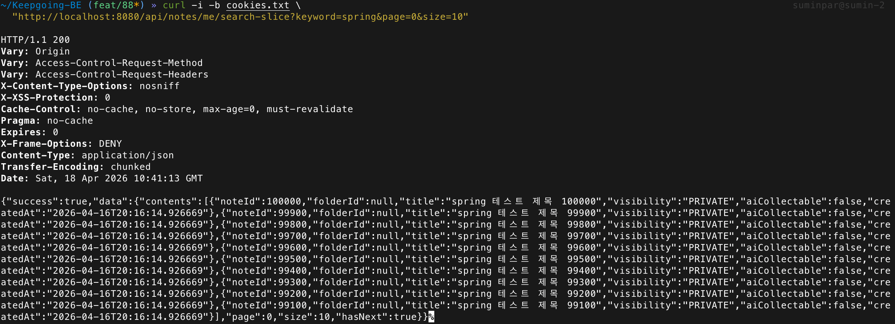
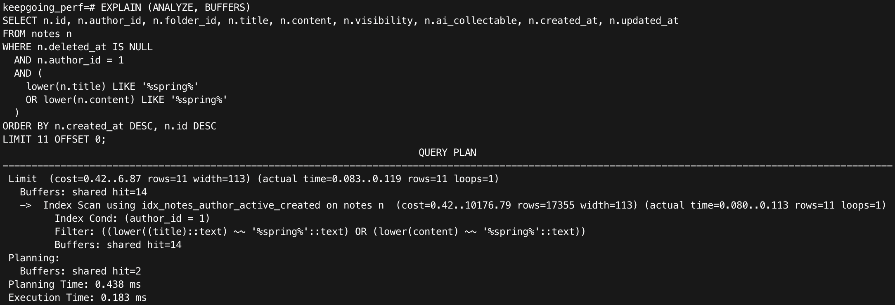
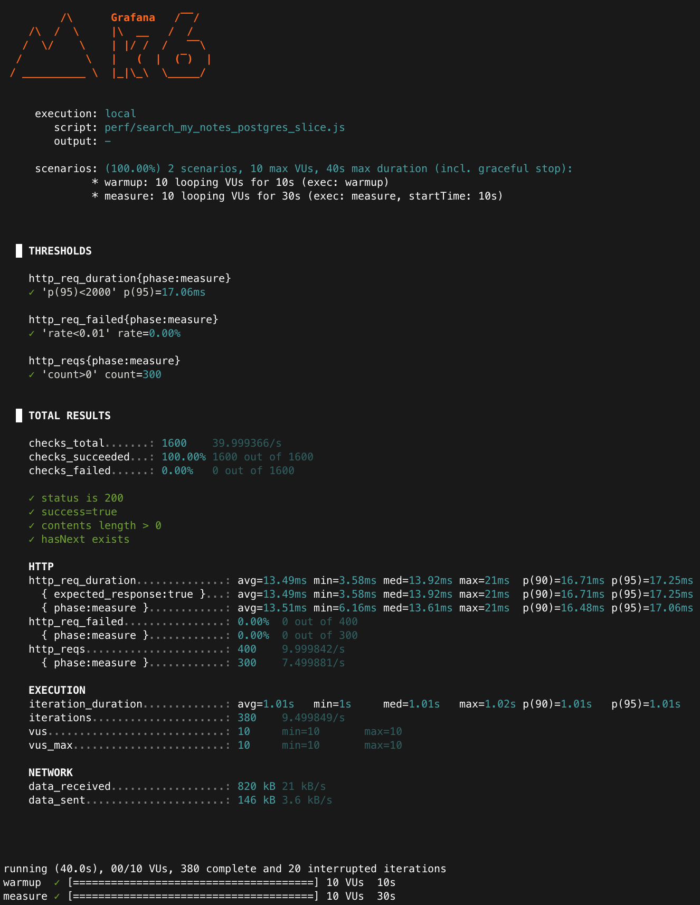

# Improved: 내 노트 검색 성능 (PostgreSQL, LIKE + pg_trgm + Slice)

## 목적

PostgreSQL 환경에서 `/api/notes/me/search`의 `Page` 응답을 `Slice`로 전환했을 때,
count query 제거가 실제 성능 개선으로 이어지는지 확인한다.

이번 실험은 검색 방식 자체를 바꾸는 실험이 아니다.
기존 `LIKE + pg_trgm` 검색을 그대로 유지한 상태에서
응답 구조만 `Page -> Slice`로 바꿨을 때 어떤 차이가 나는지를 비교하는 데 목적이 있다.

---

## 환경

- Runtime: Colima + Docker Compose
- DB: PostgreSQL 17 (docker)
- App: Spring Boot (profile=local, perf DB 연결)
- Auth: Cookie 기반 access token 사용
- Load test tool: k6

### API 스모크 체크(빈 결과 방지)

- 목적: 측정 전에 Slice 응답 구조와 인증이 정상인지 확인한다.
- Scenario URL: `GET /api/notes/me/search-slice?keyword=spring&page=0&size=10`
- 기대: HTTP 200 + `success=true` + `contents length > 0` + `hasNext=true`

<p align="center">
  
</p>

## 실험 대상

- API: `GET /api/notes/me/search-slice?keyword=spring&page=0&size=10`
- 검색 방식: `LOWER(title/content) LIKE '%spring%'`
- 응답 구조: `Slice`
- DB: PostgreSQL + `pg_trgm` + GIN index

---

## 실험 조건(고정)

- 데이터: `notes 100,000건`
- 검색 키워드: `spring`
- 키워드 포함 비율: `10%`
- 대상 사용자: `perf@example.com` / `author_id=1`
- 정렬: 최신순(`created_at DESC`, `id DESC`) 기준
- 부하 도구: `k6`
- 시나리오: warmup `10s` + measure `30s`
- 동시 사용자: `vus=10`
- 요청 간 대기: `sleep=1s`
- 반복: 각 시나리오 `3회(run1~run3)` 측정 후 mean + 범위(min~max) 기록

기준 데이터와 baseline 조건은 아래 문서와 동일하게 유지했다.
- [Baseline: LIKE + Page](search_notes_pg_like_page.md)

---

## baseline(Page)와 차이

기존 baseline의 `Page` 응답은 `totalElements`, `totalPages`를 계산해야 하므로
content query 외에 `count query`를 추가로 실행했다.

반면 `Slice` 응답은 `hasNext`만 판단하면 되므로
전체 개수를 계산하는 `count query`가 필요하지 않다.

즉, 이번 실험의 핵심 차이는 검색 방식이 아니라
**응답 구조를 바꾸면서 count query를 제거했다는 점**이다.

---

## 쿼리 실행 수 비교

- `Page` 검색: content query + count query
- `Slice` 검색: content query only

이번 변경에서는 Repository 테스트로
`Page` 검색은 2개의 쿼리,
`Slice` 검색은 1개의 쿼리만 실행되는 흐름을 확인할 수 있도록 정리했다.

근거:
- [NoteRepositoryTest.java](../../../src/test/java/com/keepgoing/keepgoing/note/repository/NoteRepositoryTest.java)
    - void searchMyNotes_executesContentAndCountQueries() 
    - void searchMyNotesSlice_executesOnlyContentQuery()
---

## EXPLAIN (ANALYZE, BUFFERS)

### 1. content query

실행 SQL은 baseline과 동일한 검색 조건을 사용하되,
`Slice`의 `hasNext` 판단을 위해 `LIMIT 11`로 1건을 더 조회하는 형태다.

결과 요약:
- Execution Time: `0.183 ms`
- Plan: `Index Scan using idx_notes_author_active_created`
- Index Cond: `author_id = 1`
- `LIKE` 조건은 filter로 적용
- Buffers: `shared hit=14`

해석:
- `Slice`에서도 여전히 `author_id + created_at DESC` 인덱스를 사용해 최근 노트를 빠르게 읽는다.
- baseline의 `LIMIT 10`보다 `LIMIT 11`로 1건을 더 읽기 때문에
  content query 시간은 소폭 증가했지만, 절대값 기준으로는 여전히 매우 빠르다.
- 즉, `Slice` 전환으로 인해 content query 자체가 새 병목이 되지는 않는다.

근거 캡처:
<p align="center">
  
</p>

### EXPLAIN 관찰 요약

- baseline(Page) content query: `0.108 ms`
- Slice content query: `0.183 ms`

즉, `Slice`는 `hasNext` 판단을 위해 1건을 더 읽으면서
content query 비용이 소폭 증가했지만,
count query를 제거하면서 전체 요청 비용은 오히려 크게 줄어든다.


---

## k6 결과

### 실행 커맨드

```bash
BASE_URL=http://localhost:8080 COOKIE_HEADER="$ACCESS_COOKIE" \
k6 run --summary-export docs/perf/postgres/results/notes_like_slice_run1.json \
perf/search_my_notes_pg_like_slice.js
```

### phase=measure 기준 요약

| run | avg (ms) | p95 (ms) | req/s | fail |
|---:|---:|---:|---:|---:|
| 1 | 15.62 | 18.15 | 7.50 | 0.00% |
| 2 | 14.45 | 17.53 | 7.50 | 0.00% |
| 3 | 13.51 | 17.07 | 7.50 | 0.00% |
| mean | 14.53 | 17.58 | 7.50 | 0.00% |

편차 범위:
- avg: `13.51 ~ 15.62 ms`
- p95: `17.07 ~ 18.15 ms`
- req/s: `7.50 ~ 7.50`

> #### 지표 해석
> `avg`: 평균 응답시간
>`p95`: 상위 5% 느린 응답 경계
>`req/s`: measure 구간 기준 처리량
>`fail`: 실패율

### 결과 해석

- 3회 모두 `fail 0.00%`로 안정적으로 수행되었다.
- avg와 p95 편차가 작아, `Slice` 응답 측정값도 비교적 안정적으로 수렴했다.

<p align="center">
  
</p>

---

## baseline(Page) 대비 비교

| 항목 | LIKE + Page | LIKE + Slice |
|---:|---:|---:|
| avg | 45.08 ms | 14.53 ms |
| p95 | 68.70 ms | 17.58 ms |
| req/s | 7.25 | 7.50 |
| fail | 0.00% | 0.00% |

### 해석

- avg는 `45.08 ms -> 14.53 ms`로 약 **3.1배 개선**
- p95는 `68.70 ms -> 17.58 ms`로 약 **3.9배 개선**
- req/s는 `7.25 -> 7.50`으로 소폭 증가
- fail은 두 경우 모두 `0.00%`

즉, 현재 PostgreSQL notes 검색에서는
검색 방식 자체보다 `Page` 응답이 요구하는 count query가 더 큰 비용을 차지하고 있었고,
`Slice` 전환이 실제 API 체감 성능 개선으로 이어졌다고 볼 수 있다.

---

## 결론

- `LIKE + pg_trgm` 검색 자체는 baseline에서도 충분히 빠른 편이었지만,
  `Page` 응답에서 추가로 발생하는 count query가 전체 응답시간에 큰 영향을 주고 있었다.
- `Slice`로 전환하면 `hasNext` 판단을 위해 1건을 더 읽는 비용만 추가되고,
  count query를 제거할 수 있어 전체 응답시간이 크게 줄어든다.
- 실제 측정 결과도 이 흐름과 일치했으며,
  현재 PostgreSQL 환경에서는 검색 방식 변경보다 `Page -> Slice` 전환이 더 우선순위가 높은 개선안임을 확인했다.

### 한 줄 정리

- 현재 PostgreSQL notes 검색에서는 검색 방식 개선보다 `Page`의 count query 제거(`Slice 전환`)가 더 큰 성능 개선 효과를 보였다.

---

## 다음 단계

1. `/api/notes/search` 공개 검색에도 동일한 `Slice` 전략을 적용할지 검토
2. keyword 분포(희귀/없는 키워드) 변경 실험
3. 필요 시 PostgreSQL Full Text Search를 비교군으로 추가
4. baseline vs slice 결과를 summary 문서로 통합해 정리

---

## 참고(측정 스코프)

- 로컬(single-machine) 환경에서의 측정 결과이며 배포 환경/네트워크 조건에 따라 절대값은 달라질 수 있다.
- 다만 동일 조건에서의 전/후 비교(개선 효과 확인)에는 충분히 유효하다.
