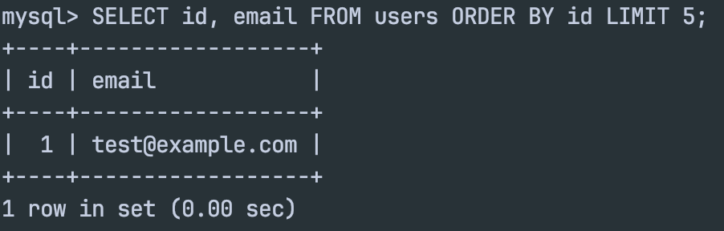
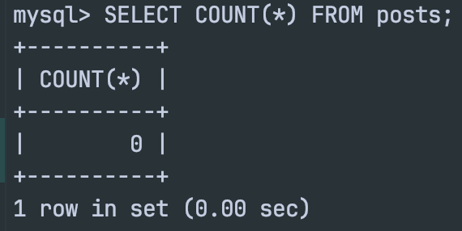
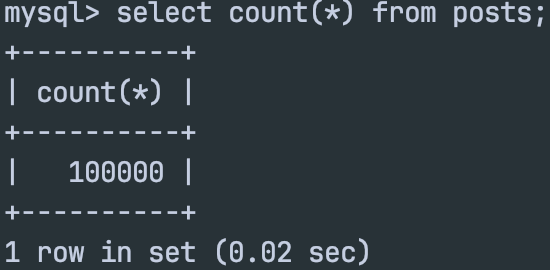
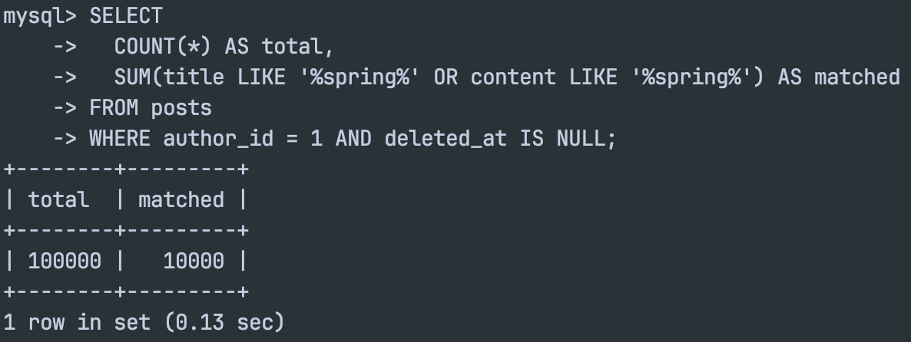
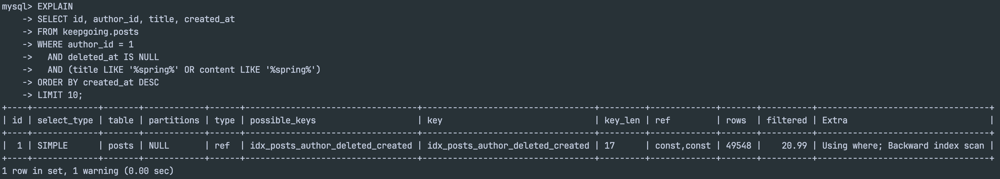
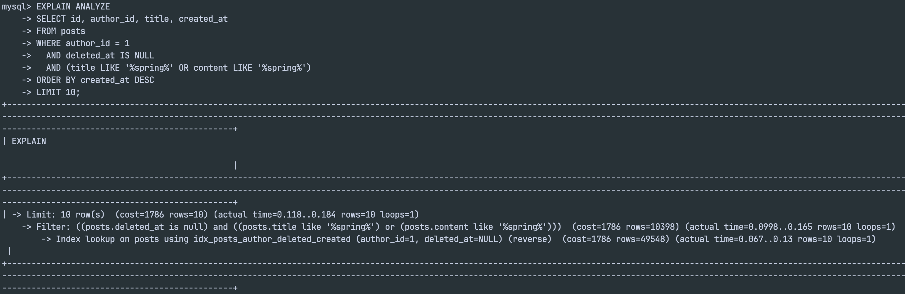
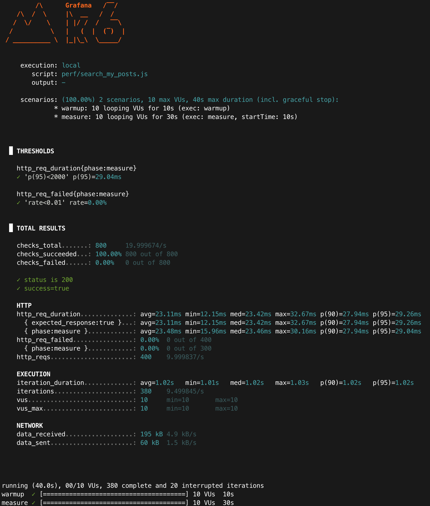

# Baseline: 내 글 검색 성능 (MySQL, LIKE)

## 목적
- 개선 전/후 성능 비교를 위해 **베이스라인(latency, p95)**을 확보한다.
- “왜 느린지/어디서 비용이 드는지”를 **EXPLAIN**으로 근거화한다.

---

## 환경
- Runtime: Colima + Docker Compose
- DB: MySQL 8.0 (docker)
- App: Spring Boot (profile=local)
- Endpoint: `GET /api/posts/me/search?keyword=spring&page=0&size=10`
- Auth: Bearer JWT accessToken 사용
- k6: `vus=10`, `duration=30s`  
  (참고: 스크립트에 `sleep(1)` 포함 → iteration_duration ≈ 1s)

---

## 데이터 세팅
- 기준 사용자(author_id): **1**
  - 근거: `SELECT id, email FROM users ORDER BY id LIMIT 5;` 결과에서 `1 | test@example.com`
- posts: **100,000 rows**
- keyword 분포: **spring 10% 포함** (seed 규칙: `n % 10 == 0`일 때 spring 포함)

### 데이터 증거
- TRUNCATE 이후:
  - `SELECT COUNT(*) FROM posts;` → **0**
- seed 실행 후:
  - `SELECT COUNT(*) FROM posts;` → **100000**

<p align="center">
  
</p>
<p align="center">
  
</p>
<p align="center">
  
</p>

### keyword 분포 확인
```sql
SELECT
  COUNT(*) AS total,
  SUM(title LIKE '%spring%' OR content LIKE '%spring%') AS matched
FROM posts
WHERE author_id = 1 AND deleted_at IS NULL;
```
<p align="center">
  
</p>
---

## 실행 계획(베이스라인 근거)
### EXPLAIN (LIKE 기반)
쿼리(개념):
```sql
EXPLAIN
SELECT id, author_id, title, created_at
FROM posts
WHERE author_id = 1
  AND deleted_at IS NULL
  AND (title LIKE '%spring%' OR content LIKE '%spring%')
ORDER BY created_at DESC
LIMIT 10;
```
- type: ref
- key: idx_posts_author_deleted_created
- rows: 49548
- Extra: Using where; Backward index scan

#### 해석:
- author_id, deleted_at, created_at 기준으로는 인덱스를 타며 정렬도 인덱스 역방향 스캔으로 처리된다.
- 하지만 LIKE '%spring%'는 인덱스를 활용하기 어려워, 조건 필터링을 위해 많은 행(rows≈49k)을 스캔하는 비용이 남는다.

<p align="center">
  
</p>

### EXPLAIN ANALYZE 요약

- Index lookup (reverse) on idx_posts_author_deleted_created (author_id=1, deleted_at=NULL)
- estimated rows: 49548 
- actual time (index lookup 단계): ~0.057..0.122s, rows=10, loops=1
- actual time (LIMIT 10 전체): ~0.066..0.134s

<p align="center">
  
</p>

## k6 결과(warm-up 10s + measure 30s)
### 실행 조건
- scenarios: warmup(10s) -> measure(30s)
- vus: 10
- keyword: spring
- size: 10
- sleep: 1s

### 실행 커맨드
```
TOKEN="<ACCESS_TOKEN>" KEYWORD="spring" \
  k6 run --summary-export "docs/perf/results/baseline_spring_run1.json" perf/search_my_posts.j
```

### 측정 결과 (phase=measure) - run3
- http_req_duration avg: 23.49ms
- http_req_duration p(95): 29.05ms
- http_reqs: 400 (≈ 10.00 req/s)
- http_req_failed: 0.00%
- 근거: summary-export JSON (baseline_spring_run3_20260223_184651.json)

<p align="center">
  
</p>

### k6 3회 측정 결과(phase=measure) 요약

- 기준: warm-up 10s + measure 30s, vus=10, keyword=spring, size=10, sleep=1s
- 근거: summary-export JSON (run1~run3)

| run | 결과 파일 | http_req_duration avg (ms) | http_req_duration p95 (ms) | http_reqs (count) | req/s(대략) | http_req_failed |
|---:|---|---:|---:|---:|---:|---:|
| 1 | baseline_spring_run1_20260223_184530.json | 25.25 | 28.61 | 400 | 10.00 | 0.00% |
| 2 | baseline_spring_run2_20260223_184610.json | 23.54 | 29.43 | 400 | 10.00 | 0.00% |
| 3 | baseline_spring_run3_20260223_184651.json | 23.49 | 29.05 | 400 | 10.00 | 0.00% |
| **mean** | - | **24.09** | **29.03** | **400** | **10.00** | **0.00%** |

- p95≈29ms, avg≈24ms로 3회 편차가 작아(±~1ms 수준) 베이스라인으로 적합

---

### 참고(측정 스코프)
- 로컬(단일 머신) 환경에서의 측정 결과이며, 배포 환경/네트워크 조건에 따라 수치는 달라질 수 있다.
- 다만 동일 조건에서의 전/후 비교(개선 효과 확인)에는 충분히 유효하다.