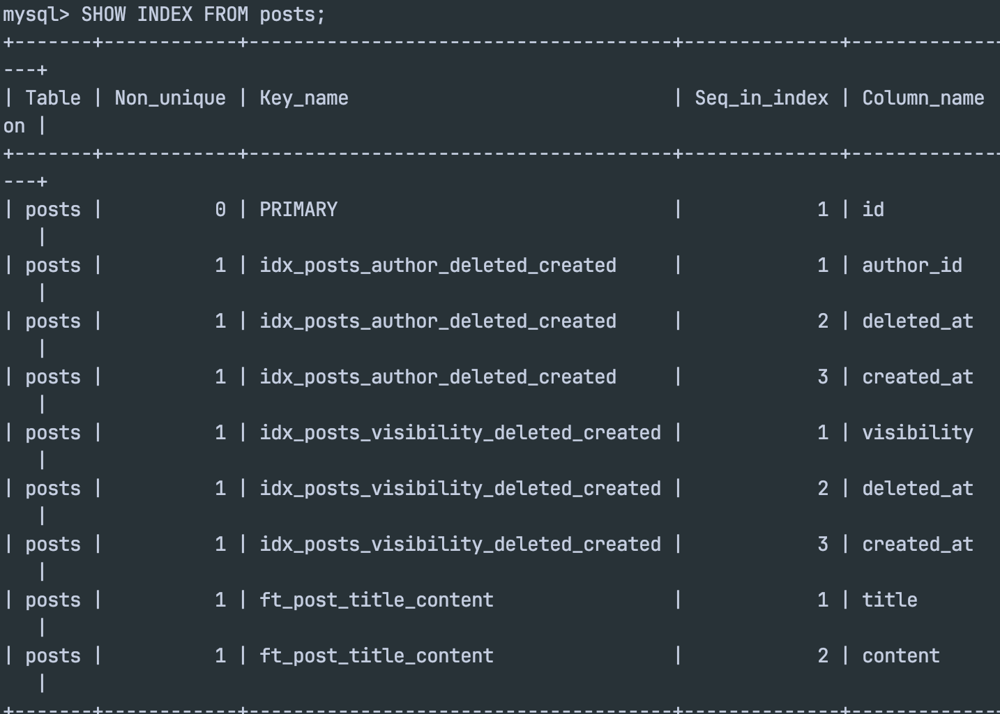
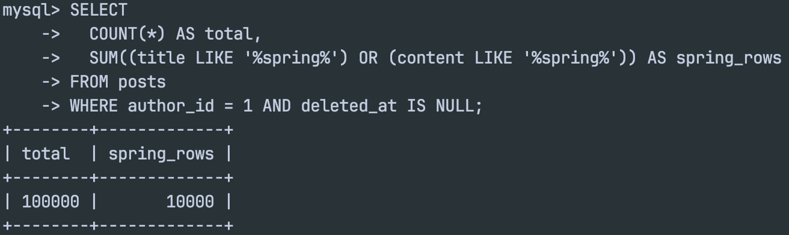
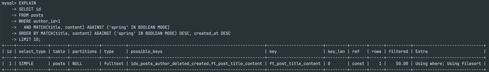
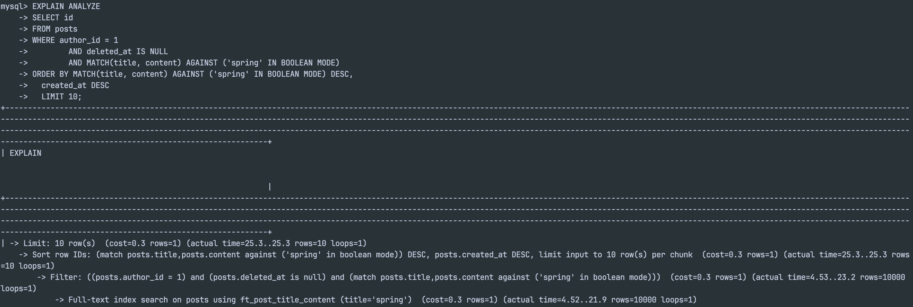
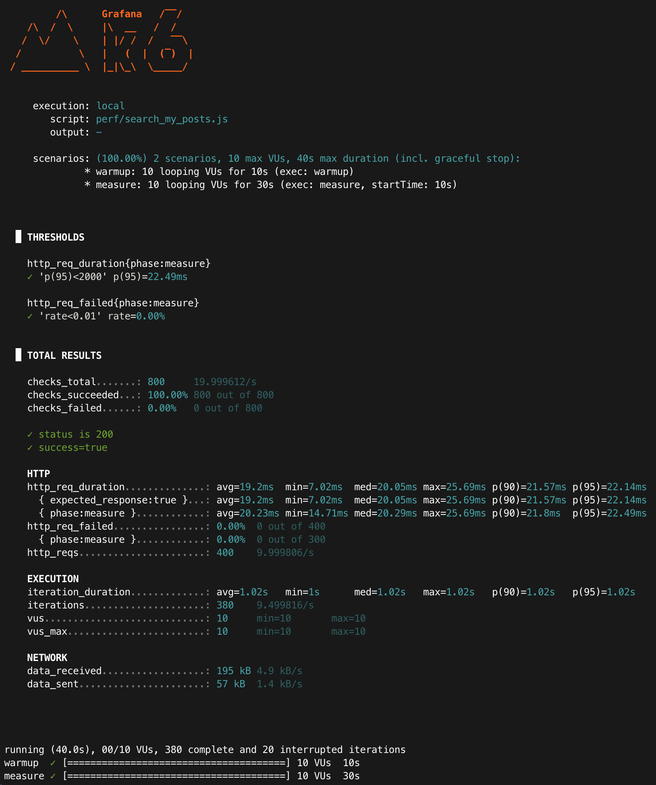

# Improved: 내 글 검색 성능 (MySQL, FULLTEXT)

## 목적
- LIKE 기반 검색의 병목(contains 검색)을 개선하기 위해 MySQL FULLTEXT(MATCH...AGAINST)를 적용한다.
- 개선 전/후 성능(latency, p95)을 동일 조건에서 비교한다.
- “왜 빨라졌는지”를 EXPLAIN/EXPLAIN ANALYZE로 근거화한다.

---

## 환경
- Runtime: Colima + Docker Compose
- DB: MySQL 8.0 (docker)
- App: Spring Boot (profile=local)
- Endpoint: `GET /api/posts/me/search?keyword=spring&page=0&size=10`
- Auth: Bearer JWT accessToken 사용
- k6: `vus=10`, `duration=30s`
  (참고: 스크립트에 `sleep(1)` 포함 → iteration_duration ≈ 1s)

---

### 동일 조건 체크리스트(전/후 공정성)
- 데이터: posts=100,000 / keyword(spring) 포함=10% / author_id=1 / deleted_at IS NULL
- API: `GET /api/posts/me/search?keyword=spring&page=0&size=10`
- 정렬: score(relevance) DESC + 최신순(`created_at DESC`) + LIMIT 10
- 부하(k6): warmup 10s → measure 30s, vus=10, sleep=1s
- 실행: 각 시나리오 3회(run1~run3) 측정 후 평균(mean) 비교

### warm-up을 두는 이유
- warmup 구간은 DB buffer pool/OS page cache/JIT 워밍업 영향을 줄여, measure 구간의 편차를 낮추기 위함이다.
- 결과 비교는 measure(30s) 구간만 사용한다.

---


## 변경 사항(요약)
### 1) 인덱스: FULLTEXT 추가
- posts(title, content)에 FULLTEXT 인덱스 추가
- 인덱스명: `ft_post_title_content`

증거:
- `SHOW INDEX FROM posts;` 결과에서 `ft_post_title_content`가 title/content에 걸려 있음

<p align="center">
  
</p>

### 2) 쿼리: LIKE → MATCH AGAINST (BOOLEAN MODE)
기존(LIKE, contains):
- `title LIKE '%spring%' OR content LIKE '%spring%'`
개선(FULLTEXT):
- `MATCH(title, content) AGAINST ('spring' IN BOOLEAN MODE)`
정렬 전략:
- relevance(score) 우선 + 최신순 보조
- `ORDER BY MATCH(...) AGAINST(...) DESC, created_at DESC`

### 3) 애플리케이션 레벨: Pageable sort 충돌 제거
- FULLTEXT 쿼리의 정렬은 SQL에 고정(Score 기반)
- Controller에서 검색 endpoint는 `safePageableUnsorted(Pageable)`로 sort를 제거하여
  nativeQuery + Pageable 조합에서 발생하는 `ORDER BY` 중복/필드명(p.createdAt) 문제를 방지

---

## 데이터 세팅(동일 조건)
- 기준 사용자(author_id): 1
- posts: 100,000 rows
- keyword 분포: spring 10% 포함 (seed 규칙: n % 10 == 0 일 때 spring 포함)

증거:
```sql
SELECT
  COUNT(*) AS total,
  SUM((title LIKE '%spring%') OR (content LIKE '%spring%')) AS spring_rows
FROM posts
WHERE author_id = 1 AND deleted_at IS NULL;
```
- 기대값: total=100000 / spring_rows=10000

(이미 baseline 문서에 있는 데이터 증거와 동일 조건 유지)
<p align="center">
  
</p>

---

## 실행 계획(개선 근거)
### EXPLAIN (FULLTEXT 기반)
쿼리:
```sql
EXPLAIN
SELECT id
FROM posts
WHERE author_id = 1
  AND deleted_at IS NULL
  AND MATCH(title, content) AGAINST ('spring' IN BOOLEAN MODE)
ORDER BY MATCH(title, content) AGAINST ('spring' IN BOOLEAN MODE) DESC, 
    created_at DESC
LIMIT 10;
```

관찰(요약):
- type: fulltext
- key: ft_post_title_content
- Extra: Using filesort (score+created_at 정렬 단계에서 발생 가능)

**해석:**
- LIKE 방식은(author_id 조건으로 인덱스를 타더라도) '%spring%' 부분을 인덱스로 해결할 수 없어 대량 스캔이 발생했다.
- FULLTEXT는 역인덱스로 후보를 빠르게 좁힌 뒤 relevance(score)를 계산해 정렬한다.
- Extra에 Using filesort가 보일 수 있는데,
  - 이는 score + created_at 정렬을 위해 후보 집합을 정렬하는 단계가 필요하기 때문이며,
  - 핵심은 후보 집합이 FULLTEXT로 “줄어든 상태”에서 sort가 수행된다는 점이다.
> LIMIT 10이 있어도 정렬 비용이 남을 수 있다. FULLTEXT는 후보를 빠르게 좁히지만, `score(relevance)` + `created_at` 정렬을 위해 후보 집합을 정렬(filesort)해야 한다. 다만 LIKE 대비 핵심 차이는 “정렬 대상 후보군이 줄어든 상태”에서 정렬이 수행된다는 점이다.

<p align="center">
  
</p>

### EXPLAIN ANALYZE (측정)
- 목적: 개선 전(LIKE)과 동일 조건에서 실제 실행 시간/행 처리량/정렬 비용을 수치로 비교한다.
- 측정 방법:
```sql
EXPLAIN ANALYZE
SELECT id
FROM posts
WHERE author_id = 1
  AND deleted_at IS NULL
  AND MATCH(title, content) AGAINST ('spring' IN BOOLEAN MODE)
ORDER BY MATCH(title, content) AGAINST ('spring' IN BOOLEAN MODE) DESC,
    created_at DESC
LIMIT 10;
```

#### EXPLAIN ANALYZE 원문 일부(캡처로 교체)
```text
 -> Limit: 10 row(s) ... (actual time=25.3..25.3 rows=10 loops=1)
    -> Sort row IDs: ... (actual time=25.3..25.3 rows=10 loops=1)
        -> Filter: ... (actual time=4.53..23.2 rows=10000 loops=1)
            -> Full-text index search on posts using ft_post_title_content ... (actual time=4.52..21.9 rows=10000 loops=1)
```

<p align="center">
  
</p>

---

## k6 결과(warm-up 10s + measure 30s)
- baseline과 동일 조건(warm-up 10s + measure 30s, vus=10, keyword=spring, size=10, sleep=1s)에서 3회 측정(run1~run3)
- 실행 커맨드:
```bash
TOKEN="<ACCESS_TOKEN>" KEYWORD="spring" \
k6 run --summary-export "docs/perf/results/fulltext_spring_run1.json" perf/search_my_posts.js
```

### 측정 결과 (phase=measure) - run3
- http_req_duration avg: 20.23ms
- http_req_duration p(95): 22.49ms
- http_reqs: 400 (≈ 10.00 req/s)
- http_req_failed: 0.00%
- 근거: summary-export JSON (fulltext_spring_run3.json)

<p align="center">
  
</p>

### k6 3회 측정 결과(phase=measure) 요약

| run | avg (ms) | p95 (ms) | rps (req/s) | vus | fail |
|---:|---:|---:|---:|---:|---:|
| run1 | 20.30 | 24.66 | 10.00 | 10 | 0.00% |
| run2 | 19.39 | 25.14 | 10.00 | 10 | 0.00% |
| run3 | 20.23 | 22.50 | 10.00 | 10 | 0.00% |
| **mean** | **19.98** | **24.10** | **10.00** | **10** | **0.00%** |

- avg 범위(min~max): 19.39~20.30ms / p95 범위(min~max): 22.50~25.14ms

#### k6 출력 수치 해석(스크린샷 기준)
- `http_req_duration`: 요청 1개의 전체 시간(네트워크+서버 처리+응답 수신). `avg/min/med/max`는 평균/최소/중앙값/최대값.
- `p(90)`, `p(95)`: 90/95 퍼센타일. p95는 “느린 상위 5%” 지연을 의미해, 사용자 체감/안정성 지표로 자주 사용한다.
- `thresholds`: 사전에 설정한 SLO 체크(예: `p(95)<2000`). PASS/FAIL은 이 조건 충족 여부다.
- `http_reqs`: 실제 HTTP 요청 수(여기서는 40초 전체 400회, measure 구간 300회). `iterations`는 VU가 수행한 루프 수로 `sleep(1)` 때문에 req/s가 ≈10으로 고정되는 형태가 된다.
- `checks`: 스크립트에서 `check()`로 검증한 항목(예: status 200, success=true). 실패율이 0이면 부하 중 기능은 정상 동작한 것이다.

## 결론(베이스라인 대비)

### Before/After 비교(핵심)
|       **항목** |  **BEFORE (LIKE)** | **AFTER (FULLTEXT)** |
|-------------:|-------------------:|---------------------:|
| EXPLAIN type |              ref    |             fulltext |
| EXPLAIN key  | idx_posts_author_deleted_created | ft_post_title_content |
| EXPLAIN rows(estimated) |   49499   |               10000  |
| EXPLAIN ANALYZE actual time (limit 10) | 0.0338..0.0546s | 25.3..25.3ms |
| k6 avg(mean) |            15.73ms |              19.98ms |
| k6 p95(mean) |            19.73ms |              24.10ms |
|  req/s(mean) |              10.00 |                10.00 |
|         fail |              0.00% |                0.00% |

**해석(요약):**
- 공정성 메모: LIKE는 최신순 정렬, FULLTEXT는 관련도(score)+최신순 정렬로 “검색 품질(랭킹)” trade-off를 포함한다.
- avg(mean): 15.73ms → 19.98ms (약 27.0%↑)
- p95(mean): 19.73ms → 24.10ms (약 22.1%↑)
- 동일 RPS(≈10 req/s)에서 실패율 0% 유지
- 실험 설계 메모: warm-up/measure 분리 + 3회 반복(run1~run3) + mean/min~max로 편차를 함께 제시했다.
- 결론: 이번 조건(키워드 10% + relevance 정렬)에서는 FULLTEXT의 정렬 비용이 더 크게 작용해 LIKE 대비 느리게 측정되었다.

### 이 결과가 의미하는 것
이번 측정에서는 FULLTEXT 전환이 성능을 자동으로 개선하지 않음을 확인했다. (검색어 선택도 10% + relevance 정렬 + LIMIT 10 조합)

#### 공정성 메모: 정렬 정책 차이
- LIKE: 최신순(`created_at DESC`) 중심
- FULLTEXT: 관련도(`score DESC`) + 최신순 보조
- 즉 FULLTEXT는 “검색 품질(랭킹)”을 포함한 trade-off를 반영한다.

#### 왜 EXPLAIN rows≈49k인데도 LIKE가 빨라질 수 있나
- EXPLAIN의 rows는 “최대 후보 범위” 추정치다.
- 실제 실행에서는 최신 영역에서 조건을 만족하는 10개를 찾는 순간 종료될 수 있다(early stop).
- keyword가 10%처럼 흔하면 최신 구간에서 금방 10개를 채워 전체 범위를 끝까지 훑지 않을 수 있다.

#### FULLTEXT가 느려질 수 있는 이유(이번 워크로드)
- FULLTEXT는 후보를 역인덱스로 찾지만, `score(relevance) + created_at` 정렬을 위해 후보 집합을 정렬(filesort)해야 한다.
- keyword가 흔하면 후보 집합이 커져, `LIMIT 10`이어도 정렬 대상이 작지 않을 수 있다.

#### 언제 FULLTEXT가 유리해지나
- keyword가 희소(예: 0.1~1%)
- 다중 키워드/문장 검색, 동의어/오타 보정 등 검색 품질 요구가 높을 때
- 데이터/트래픽이 커져 LIKE 방식의 스캔 비용이 병목이 될 때

> NOTE: 이번 결과는 FULLTEXT가 만능 성능 개선이 아니라 워크로드/정렬/키워드 분포에 따라 trade-off가 있음을 보여준다.

### 운영/롤백 고려
- 대량 seed(10만)는 `docs/perf/`에 분리해 성능 테스트 시점에만 주입한다.
- local 프로필에서만 seed 위치를 추가하여 운영 환경에 seed가 적용되지 않도록 한다.
- FULLTEXT 적용 후 문제가 발생하면 기존 LIKE 메서드(`searchMyPostsLike`)로 즉시 롤백 가능하도록 병행 유지한다.

---

## 참고(측정 스코프)
- 로컬(single-machine) 환경에서의 측정 결과이며 배포 환경/네트워크 조건에 따라 절대값은 달라질 수 있다.
- 단, 동일 조건에서 전/후 비교(개선 효과 확인)에는 충분히 유효하다.

