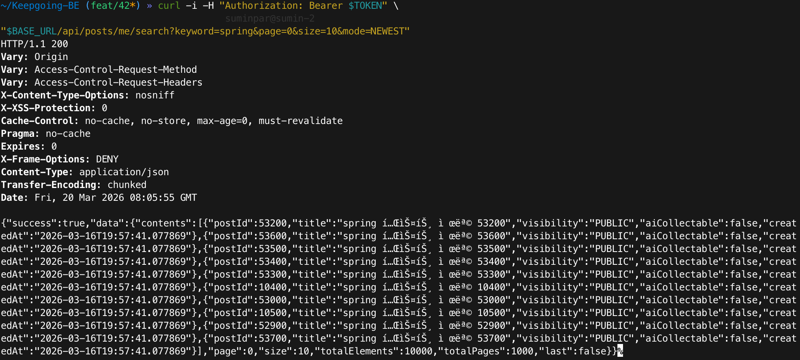
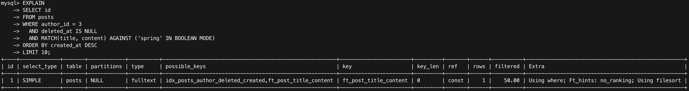
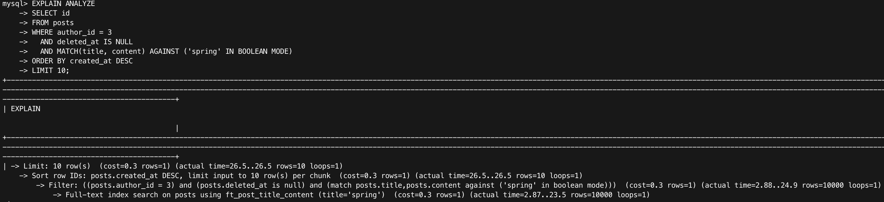
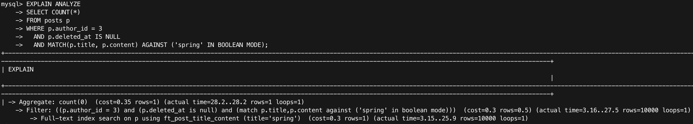
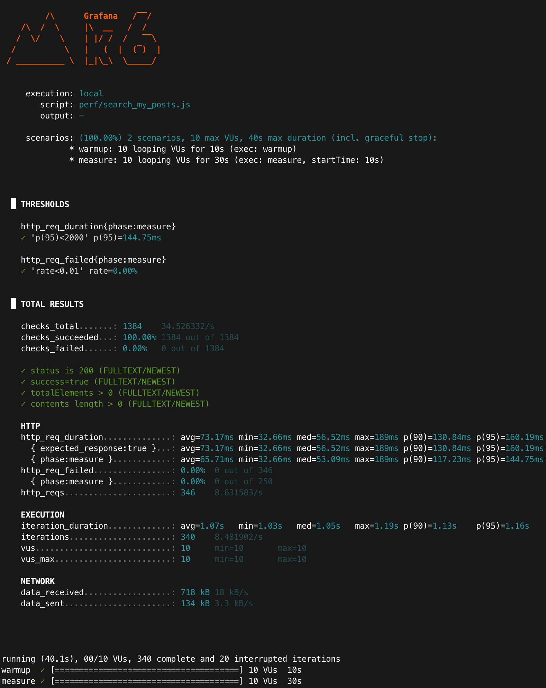

> **[Archive]** MySQL 8.0 FULLTEXT 기반 벤치마크. PostgreSQL 전환(#55) 이후 현재 API와 일치하지 않음.

# Improved: 내 글 검색 성능 (MySQL, FULLTEXT by NEWEST)

## 목적
- FULLTEXT 기반 검색에서 정렬 정책을 `NEWEST(created_at DESC)`로 변경했을 때 성능/비용 변화를 측정한다.
- 동일 조건에서 `EXPLAIN/EXPLAIN ANALYZE + k6`로 근거를 남긴다.
- SCORE 대비 “정렬 비용 감소”가 실제로 유효한지 확인한다.

---

## 환경
- Runtime: Colima + Docker Compose
- DB: MySQL 8.0 (docker)
- App: Spring Boot (profile=local)
- Target endpoint: `GET /api/posts/me/search` (mode=NEWEST)
- Auth: Bearer JWT accessToken
- k6: vus=10, warmup 10s + measure 30s, sleep=1s

### API 스모크 체크(빈 결과 방지)
- Scenario URL: `GET /api/posts/me/search?keyword=spring&page=0&size=10&mode=NEWEST`
- 기대: HTTP 200 + totalElements > 0

<p align="center">
  
</p>

---

## 동일 조건 체크리스트(공정성)
- 데이터: posts=100,000 / spring 포함 10% / author_id=3 / deleted_at IS NULL
- API: `GET /api/posts/me/search?keyword=spring&page=0&size=10&mode=NEWEST`
- 정렬: created_at DESC (NEWEST) + LIMIT 10
- 부하(k6): warmup 10s → measure 30s, vus=10, sleep=1s
- 실행: run1~run3 반복 후 mean + 범위(min~max) 기록

---

## 변경 사항(요약)
- Repository: `searchMyPostsFullTextByNewest(...)` 사용
- Query: `MATCH ... AGAINST` 유지 + `ORDER BY created_at DESC` 적용

---

## 실행 계획(근거)

### EXPLAIN (FULLTEXT 기반)
```sql
EXPLAIN
SELECT id
FROM posts
WHERE author_id = 3
  AND deleted_at IS NULL
  AND MATCH(title, content) AGAINST ('spring' IN BOOLEAN MODE)
ORDER BY created_at DESC
LIMIT 10;
```

- type: fulltext
- key: ft_post_title_content
- Extra: Using where; Ft_hints: no_ranking; Using filesort

#### 해석:
- FULLTEXT/SCORE는 `ORDER BY MATCH(...) DESC`로 score(랭킹) 계산/정렬 비용이 커질 수 있다.
- FULLTEXT/NEWEST는 `Ft_hints: no_ranking`으로 score 계산을 생략하고 `created_at DESC`로 최신 글을 반환한다.
- `Using filesort`는 FULLTEXT 인덱스가 `created_at` 정렬을 보장하지 못해 정렬 단계가 남을 수 있음을 의미한다.

<p align="center">
  
</p>

### EXPLAIN ANALYZE (content query, LIMIT 10)
```sql
EXPLAIN ANALYZE
SELECT id
FROM posts
WHERE author_id = 3
  AND deleted_at IS NULL
  AND MATCH(title, content) AGAINST ('spring' IN BOOLEAN MODE)
ORDER BY created_at DESC
LIMIT 10;
```

#### EXPLAIN ANALYZE 원문 일부
```text
  -> Limit: 10 row(s) ... (actual time=26.5s..26.5s rows=10 loops=1)
    -> Sort row IDs: posts.created_at DESC ... (actual time=26.5s..26.5s rows=10 loops=1)
        -> Filter: ... (actual time=2.88s..24.9s rows=10000 loops=1)
            -> Full-text index search on posts using ft_post_title_content ... (actual time=2.87s..23.5s rows=10000 loops=1)
```

<p align="center">
  
</p>

### COUNT 쿼리 비용(Page의 countQuery)
> Page 응답은 요청 1회당 content query + countQuery가 함께 실행된다.

```sql
EXPLAIN ANALYZE
SELECT COUNT(*)
FROM posts p
WHERE p.author_id = 3
  AND p.deleted_at IS NULL
  AND MATCH(p.title, p.content) AGAINST ('spring' IN BOOLEAN MODE);
```

캡처 요약:
- Full-text index search rows=10000 (spring 10% 워크로드)
- actual time: **~3.15..25.9s** (FTS scan) / **~28.2s** (COUNT aggregate 전체)

<p align="center">
  
</p>

### DB(초 단위) vs k6(API, ms 단위) 괴리 해석
- EXPLAIN ANALYZE는 DB에서 쿼리 1회를 단독 실행한 실측(캐시/시점/동시성에 따라 변동)이다.
- k6는 warmup 이후 API 전체 시간을 반복 측정한 통계치(avg/p95)이며, 본 문서에서는 DB 결과는 병목 가능성(정렬/COUNT) 설명, 체감 비교는 k6 지표로 해석한다.

---

## k6 결과(warm-up 10s + measure 30s)
- 실행 커맨드:
```bash
VARIANT=FULLTEXT MODE=NEWEST TOKEN="$TOKEN" KEYWORD="spring" \
  k6 run --summary-export "docs/perf/results/fulltext_newest_spring_run1.json" perf/search_my_posts.js
```

### 측정 결과 (phase=measure) - run3
- http_req_duration{phase:measure} avg: **65.71ms**
- http_req_duration{phase:measure} p(95): **144.75ms**
- http_reqs: **346** (≈ **8.63 req/s**)
- http_req_failed{phase:measure}: **0.00%**
- 근거: summary-export JSON (`fulltext_newest_spring_run3.json`)

<p align="center">
  
</p>

### k6 3회 측정 결과(phase=measure) 요약

| run | avg (ms) | p95 (ms) | http_reqs | req/s(대략) | fail |
|---:|--------:|--------:|----------:|------------:|-----:|
| 1 | 67.75 | 148.83 | 384 | 9.60 | 0.00% |
| 2 | 60.21 | 144.57 | 376 | 9.37 | 0.00% |
| 3 | 65.71 | 144.75 | 346 | 8.63 | 0.00% |
| **mean** | **64.56** | **146.05** | **369** | **9.20** | **0.00%** |

- 편차 범위(run1~run3): avg 60.21~67.75ms / p95 144.57~148.83ms

#### 지표 해석
- `avg`: 평균 응답시간(중심 지표)
- `p95`: 상위 5% 느린 응답 경계(체감 품질)
- `req/s`: 처리량(응답이 느려지면 감소)
- `fail`: 실패율(0% 유지가 비교 전제)

## 결론

### 요약
- NEWEST는 `Ft_hints: no_ranking`으로 score(랭킹) 계산을 생략해, SCORE 대비 평균 응답시간(avg)이 낮게 측정되었다.
- 다만 `created_at DESC` 정렬이 필요해 `Using filesort`가 남을 수 있으며, 그 영향으로 tail(p95)은 SCORE 대비 비슷하거나 소폭 악화될 수 있다.
- 평균(avg)은 개선되더라도, 최신순 정렬(filesort)·countQuery·환경 편차 영향으로 tail(p95)은 크게 줄지 않거나 오를 수 있다.
- k6(mean, phase=measure) 기준: avg **64.56ms**, p95 **146.05ms**, fail **0%**. 처리량(req/s)은 SCORE(9.27)와 유사(NEWEST 9.20).
- Page 기반 응답에서는 countQuery가 항상 수행되므로, 운영에서는 `Slice`(count 제거) 또는 count 근사/캐시 전략을 함께 고려한다.

### FULLTEXT/SCORE 대비 (k6 지표)

|    항목 | FULLTEXT/SCORE(mean) | FULLTEXT/NEWEST(mean) |
|------:|---:|---:|
|   avg | 80.35ms | 64.56ms |
|   p95 | 137.49ms | 146.05ms |
| req/s | 9.27 | 9.20 |
|  fail | 0.00% | 0.00% |

---

## 참고(측정 스코프)
- 로컬(single-machine) 환경에서의 측정 결과이며 배포 환경/네트워크 조건에 따라 절대값은 달라질 수 있다.
- 단, 동일 조건에서 전/후 비교(개선 효과 확인)에는 충분히 유효하다.
