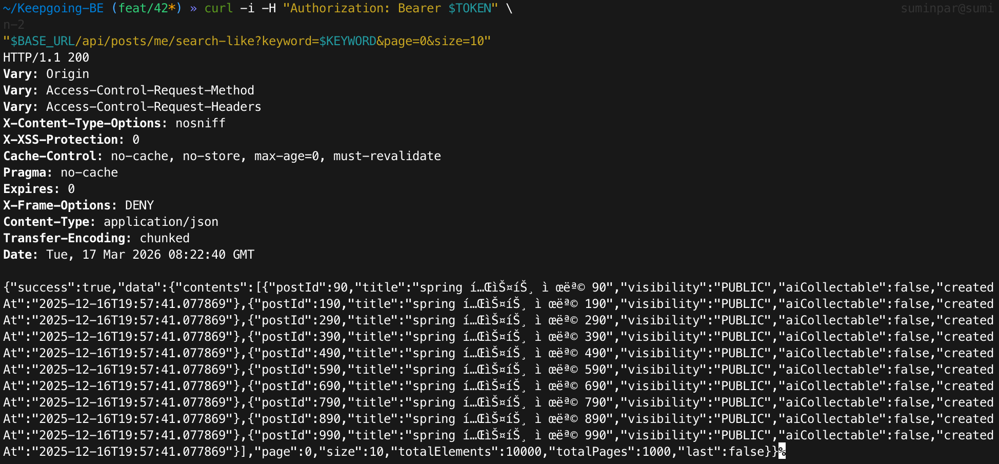
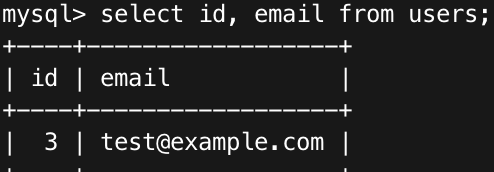
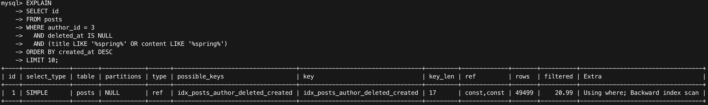
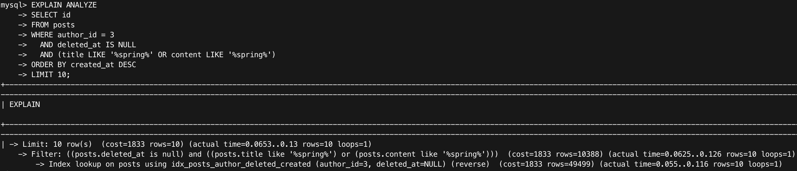
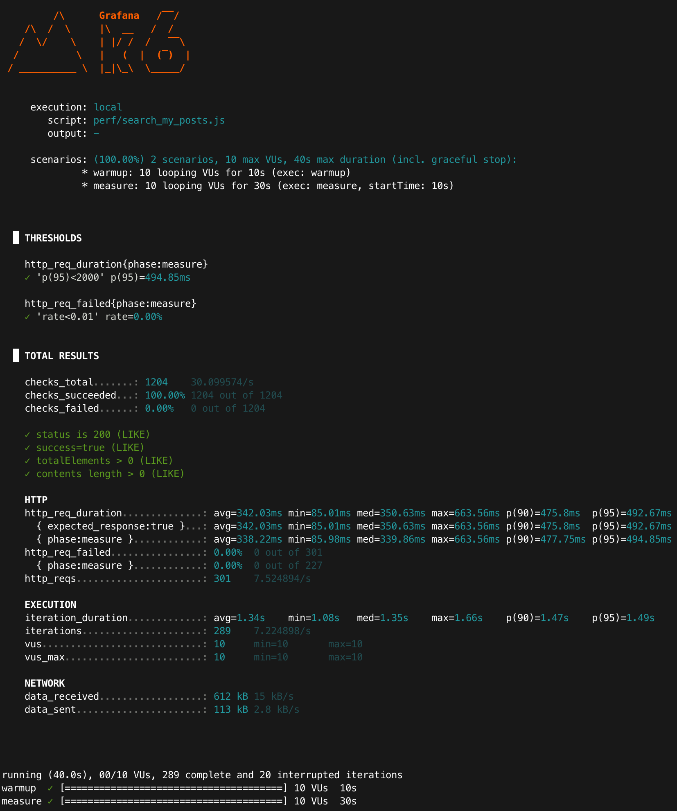

> **[Archive]** MySQL 8.0 LIKE 기반 벤치마크. PostgreSQL 전환(#55) 이후 검색 방식이 변경됨.

# Baseline: 내 글 검색 성능 (MySQL, LIKE baseline)

## 목적
- 성능 개선 전(베이스라인) 지표(latency, p95)를 확보한다.
- “왜 느린지/어디서 비용이 드는지”를 **EXPLAIN**으로 근거화한다.

---

## 환경
- Runtime: Colima + Docker Compose
- DB: MySQL 8.0 (docker)
- App: Spring Boot (profile=local)
- Target endpoint: `GET /api/posts/me/search-like`
- Auth: Bearer JWT accessToken 사용
- k6: `vus=10`, `duration=30s`  
  (참고: 스크립트에 `sleep(1)` 포함 → iteration_duration ≈ 1s)

### API 스모크 체크(빈 결과 방지)
- 목적: 측정 전에 “인증/author_id 매칭/데이터 주입”이 정상인지 확인한다.
- Scenario URL: `GET /api/posts/me/search-like?keyword=spring&page=0&size=10`
- 기대: HTTP 200 + totalElements > 0

<p align="center">
  
</p>

---

### 동일 조건 체크리스트(전/후 공정성)
- 데이터: posts=100,000 / keyword(spring) 포함=10% / author_id=3 / deleted_at IS NULL
- API: `GET /api/posts/me/search-like?keyword=spring&page=0&size=10`
- 정렬: 최신순(`created_at DESC`) + LIMIT 10
- 부하(k6): warmup 10s → measure 30s, vus=10, sleep=1s
- 실행: 각 시나리오 3회(run1~run3) 측정 후 mean(평균) + 범위(min~max) 기록

### warm-up을 두는 이유
- warmup 구간은 DB buffer pool/OS page cache/JIT 워밍업 영향을 줄여, measure 구간의 편차를 낮추기 위함이다.
- 결과 비교는 measure(30s) 구간만 사용한다.

### 실험 설계(재현성)
- measure 구간 기준으로 3회(run1~run3) 반복 측정하고 mean(평균) + 범위(min~max)를 함께 기록한다.
- 로컬/도커 환경 특성상 편차가 존재하므로, 전/후 비교는 동일 조건에서의 상대 비교로 해석한다.

---

## 데이터 세팅
- 기준 사용자(author_id): **3**
  - 근거: `SELECT id, email FROM users;` 결과에서 `3 | test@example.com`
- posts: **100,000 rows**
- keyword 분포: **spring 10% 포함** (seed 규칙: `n % 10 == 0`일 때 spring 포함)

### 데이터 증거
- TRUNCATE 이후:
  - `SELECT COUNT(*) FROM posts;` → **0**
- seed 실행 후:
  - `SELECT COUNT(*) FROM posts;` → **100000**

<p align="center">
  
</p>
<p align="center">
  
</p>
<p align="center">
  
</p>

### keyword 분포 확인
```sql
SELECT
  COUNT(*) AS total,
  SUM((title LIKE '%spring%') OR (content LIKE '%spring%')) AS matched
FROM posts
WHERE author_id = 3 AND deleted_at IS NULL;
```
<p align="center">
  
</p>

---

## 실행 계획(베이스라인 근거)
### EXPLAIN (LIKE 기반)
쿼리(개념):
```sql
EXPLAIN
SELECT id
FROM posts
WHERE author_id = 3
  AND deleted_at IS NULL
  AND (title LIKE '%spring%' OR content LIKE '%spring%')
ORDER BY created_at DESC
LIMIT 10;
```
- type: ref
- key: idx_posts_author_deleted_created
- rows: 49499
- Extra: Using where; Backward index scan

#### 해석:
- author_id, deleted_at, created_at 기준으로는 인덱스를 타며 정렬도 인덱스 역방향 스캔으로 처리된다.
- 하지만 LIKE '%spring%'는 인덱스를 활용하기 어려워, 조건 필터링을 위해 많은 행(rows≈49k)을 스캔하는 비용이 남는다.
> LIMIT 10이 있어도 `'%spring%'`(contains) 조건은 인덱스에서 바로 걸러지지 않아, 후보(rows≈49k) 내부에서 문자열 비교가 발생한다. 
> keyword 포함 비율이 낮아질수록(예: 1%) “10개를 찾기까지 검사하는 행 수”가 늘어나 tail latency가 악화될 수 있다.

<p align="center">
    
</p>

### EXPLAIN ANALYZE (측정)
```sql
EXPLAIN ANALYZE
SELECT id
FROM posts
WHERE author_id = 3
  AND deleted_at IS NULL
  AND (title LIKE '%spring%' OR content LIKE '%spring%')
ORDER BY created_at DESC
LIMIT 10;
```

#### EXPLAIN ANALYZE 원문 일부
```text
-> Limit: 10 row(s) ... (actual time=0.0653..0.13 rows=10 loops=1)
  -> Filter: ... (actual time=0.0625..0.126 rows=10 loops=1)
    -> Index lookup on posts using idx_posts_author_deleted_created ... (actual time=0.055..0.116 rows=10 loops=1)
```

- Index lookup (reverse) on idx_posts_author_deleted_created (author_id=3, deleted_at=NULL)
- estimated rows: 49499
- actual time (index lookup 단계): ~0.055..0.116s, rows=10, loops=1
- actual time (LIMIT 10 전체): ~0.0653..0.13s, rows=10, loops=1
> 참고: EXPLAIN ANALYZE는 실측이므로 cache/컨테이너 스케줄링에 따라 편차가 발생할 수 있어 
> 3~5회 반복 후 대표값(예: median 또는 범위(min~max))을 사용한다.

<p align="center">
    
</p>

### DB 지표와 API 지표의 스케일 차이
- EXPLAIN ANALYZE는 **DB 쿼리 실행 시간**(초/밀리초)을 보여준다.
- k6의 http_req_duration은 **API 전체 시간**(보안 필터 → 컨트롤러/서비스 → DB → DTO 매핑/직렬화 → 네트워크)을 포함하므로, DB 단독 시간보다 크게 나타날 수 있다.

## k6 결과(warm-up 10s + measure 30s)
### 실행 조건
- scenarios: warmup(10s) -> measure(30s)
- vus: 10
- keyword: spring
- size: 10
- sleep: 1s

### 실행 커맨드
```bash
VARIANT=LIKE TOKEN="$TOKEN" KEYWORD="spring" \
  k6 run --summary-export "docs/perf/results/like_spring_run1.json" perf/search_my_posts.js
```

### 측정 결과 (phase=measure) - run3
- http_req_duration{phase:measure} avg: **338.23ms**
- http_req_duration{phase:measure} p(95): **494.85ms**
- http_reqs: **301** (≈ **7.52 req/s**)
- http_req_failed{phase:measure}: **0.00%**
- 근거: summary-export JSON (`like_spring_run3.json`)

<p align="center">
  
</p>

### k6 3회 측정 결과(phase=measure) 요약

- 기준: warm-up 10s + measure 30s, vus=10, keyword=spring, size=10, sleep=1s
- 근거: summary-export JSON (like_spring_run1~run3)

|      run | http_req_duration{phase:measure} avg (ms) | http_req_duration{phase:measure} p95 (ms) | http_reqs (count) | req/s(대략) | http_req_failed{phase:measure} |
|---------:|------------------------------------------:|------------------------------------------:|------------------:|-----------:|------------------------------:|
|        1 |                                    407.87 |                                    490.76 |               284 |       7.10 |                         0.00% |
|        2 |                                    358.71 |                                    497.59 |               295 |       7.37 |                         0.00% |
|        3 |                                    338.23 |                                    494.85 |               301 |       7.52 |                         0.00% |
| **mean** |                                **368.27** |                                **494.40** |          **293**  |   **7.33** |                     **0.00%** |

- k6(phase=measure) 3회 평균: **avg 368.27ms / p95 494.40ms** (fail 0%).
- 편차 범위(run1~3): avg 338.23~407.87ms / p95 490.76~497.59ms.

#### 지표 해석
- `avg`: 평균 응답시간(중심 지표)
- `p95`: 상위 5% 느린 응답 경계(체감 품질)
- `req/s`: 처리량(응답이 느려지면 감소)
- `fail`: 실패율(0% 유지가 비교 전제)

### 추가 관측
- req/s(≈7.33)는 `sleep=1s`가 포함된 시나리오에서 "응답 시간 + 대기"가 합쳐진 결과이며, 응답 시간이 길어지면 동일 VU에서 req/s도 함께 감소한다.
- 결과 비교 시에는 `http_req_duration{phase:measure}`(avg/p95)와 함께 `http_reqs`(처리량), `http_req_failed`(실패율)를 세트로 본다.

---

## 다음 단계
- FULLTEXT(score 정렬): `GET /api/posts/me/search?keyword=spring&page=0&size=10&mode=SCORE`
- FULLTEXT(newest 정렬): `GET /api/posts/me/search?keyword=spring&page=0&size=10&mode=NEWEST`
- 위 두 시나리오도 동일 조건(vus/duration/seed/keyword)으로 k6 3회 + EXPLAIN/EXPLAIN ANALYZE를 수행하여 상대 비교한다.

---

### 참고(측정 스코프)
- 로컬(단일 머신) 환경에서의 측정 결과이며, 배포 환경/네트워크 조건에 따라 수치는 달라질 수 있다.
- 다만 동일 조건에서의 전/후 비교(개선 효과 확인)에는 충분히 유효하다.
